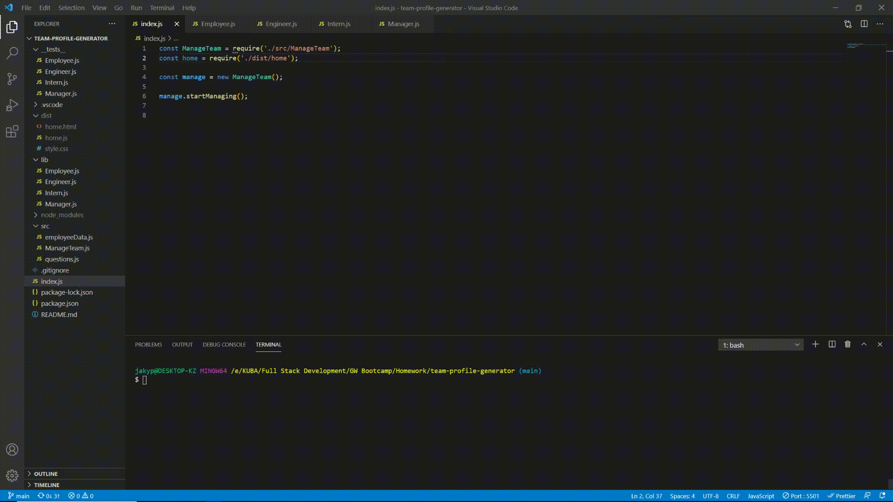

# Team Profile Generator

  ## Table of Contents:

  * [Description](#description)
  * [Installation instructions](#InstallationInstructions)
  * [Usage](#Usage)
  * [Contributors](#Contributors)
  * [Tests](#Tests)
  * [License](#License)
  * [Questions](#Questions)

    
  

  

   

  ### Html output
   

  

    
  ## [Description](#description)

  This application will prompt number of questions to user in colsole and based on the answers will generate an HTML file with the content provided by the user.
    
  ## [Installation instructions](#InstallationInstructions)

  To install the packages run "-npm i" command  
  Used libraries: 
  * Inquirer
  * Jest
  * fs
  
   

  ## [Usage](#Usage)

 To start the application run "-node index.js".  
 Most of the questions require answers in text format.  
There are 3 types of employees can be added: Manager, Engineer and Intern. 
Engineers and Interns can be any number, Manager is only 1.
    
  ## [Contributors](#Contributors)

  Only myself for now
    
  ## [Tests](#Tests)

  Test execution and result can be seen in below GIF image.  
   
  
    
  ## [License](#License)

  Copyright (c) Kuba Z Production. All rights reserved.
    
  ## [Questions](#Questions)

  If any questions dont hesitate to reach out.  
  Github username: [kZhaanbaev](https://github.com/kZhaanbaev)  
  email: k.zhaanbaev4@gmail.com
